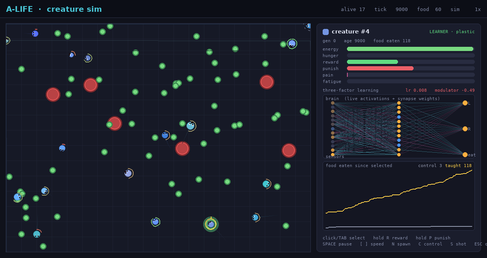

# A-Life Creature Sim — Proof of Concept

A minimal proof of concept for a Creatures-style artificial-life core. It exists
to prove the two things that made the original *Creatures* special and that most
modern A-life sims dropped:

1. **Within-lifetime learning.** A single creature can be taught by the player (or
   learn on its own from intrinsic reward) and *measurably* changes its behavior
   during its own life.
2. **Heritable, evolvable genetics.** A diploid genome encodes the brain and the
   biochemistry; reproduction is sexual (crossover + mutation); population traits
   drift across generations under selection.

The two systems are kept deliberately **separate**: evolution operates on the
genome *between* lives, plasticity operates on the brain *within* a life. Learned
weights are never inherited (no Lamarckism). That separation is the entire point.

## The two demoable moments

**Mode 1 — within-life learning (teaching).** Open the viewer, select a creature,
and teach it with reward/punish keys. A creature that can learn pulls measurably
ahead of an otherwise-identical frozen "control" creature at foraging.



The right-hand inspector shows the selected creature's biochemistry (energy,
hunger, reward, punishment, pain, fatigue), its three-factor learning readout
(learning rate + live neuromodulator), a **real-time picture of its neural net**
— every node colored by activation, every synapse drawn and tinted by its current
weight as the brain re-wires — and a chart of food eaten since you selected it,
the taught creature (yellow) against the frozen control (grey). The frame above
is a real run: the pupil has learned to feed itself (118 vs the control's 3),
purely from intrinsic reward.

Headless evidence for the same effect is in `benchmark.py`:

```
$ python benchmark.py
learner / control:  ~2.4x      # learner eats roughly 2-3x as much food per life
```

The learner and the control are the *same born brain with the same exploration
noise*; the only difference is whether the three-factor Hebbian rule is allowed
to change the weights. Averaged over many random born brains, learning wins
clearly.

**Mode 2 — headless evolution (genetics).** Run a population for N generations
under finite-food + hazard pressure and watch the logged population statistics
drift. A typical 40-generation run:

```
metric                 gen0-7   gen32-39
mean_food                3.0  ->   5.5     # foraging competence ~doubles
mean_max_speed           2.5  ->   3.0     # faster creatures selected
mean_metabolic_rate     0.050 ->  0.026    # metabolism gets more efficient
mean_learning_rate      0.014 ->  0.018    # evolution even favors better learners
mean_fitness            43    ->   70
```

Per-generation stats are written to `stats.csv`.

## How to run

```bash
pip install numpy pygame          # the only dependencies (pytest for the tests)

# Mode 1: interactive teaching viewer
python main.py --mode interactive
#   click / TAB : select a creature (TAB cycles through them)
#   hold R      : reward the selected creature  ("yes, like that")
#   hold P      : punish the selected creature  ("no, not that")
#   SPACE       : pause / resume
#   [ ]         : slow down / speed up the simulation (1x..8x)
#   N           : spawn a fresh random creature
#   C           : jump selection to the frozen control creature
#   F           : toggle follow highlight
#   S           : save a screenshot (./screenshots/)
#   ESC / close : quit (writes teaching_metric.csv so the curve is plottable)
#
#   The grey dashed-ring creature is the frozen, untaught control. The creature
#   you are teaching (and the control) are kept from starving so you can teach a
#   single pupil continuously and watch it pull ahead. Try: select a wanderer,
#   hold R whenever it heads toward green food, hold P when it drifts toward a red
#   hazard, and watch the yellow line in the chart climb above the grey one.

# Mode 2: headless evolution
python main.py --mode evolve --generations 200 --pop 40   # writes stats.csv

# Within-life-learning benchmark (headless, reproducible)
python benchmark.py --pairs 40 --ticks 24000

# Unit tests
python -m pytest tests/
```

## Architecture

The simulation core is completely decoupled from rendering, so it runs headless
and accelerated for evolution and in real time under pygame for teaching.

| File | Responsibility |
|------|----------------|
| `config.py`   | One dataclass of every tunable knob. No magic numbers elsewhere. |
| `genome.py`   | Diploid genome: genes, dominance-based expression, crossover, mutation, JSON save/load. |
| `biochem.py`  | Chemical concentrations (glucose, hunger, pain, reward, punishment, fatigue, age), Euler-integrated each tick. |
| `brain.py`    | Small feed-forward NumPy net + the three-factor Hebbian learning rule with eligibility traces. |
| `creature.py` | Binds genome → phenotype → brain + biochem + body. Sensors, motors, metabolism, death. |
| `world.py`    | 2D world: food, hazards, collisions, the sim step. No rendering. |
| `render.py`   | pygame viewer + teaching input. |
| `evolve.py`   | Headless population runner: selection, sexual reproduction, per-generation CSV stats. |
| `benchmark.py`| Headless within-life-learning benchmark (learner vs frozen control). |
| `main.py`     | Entry point (`--mode interactive|evolve|benchmark`). |
| `tests/`      | Unit tests for genome crossover/mutation/expression and the biochem + learning rule. |

### The brain and the learning rule

A two-layer feed-forward net (`inputs → hidden → motors`) whose hidden width comes
from the genome. Inputs are external sensors (bearing/proximity to nearest food,
hazard and creature) **plus** internal drives from the biochemistry (hunger, pain,
being-rewarded) — feeding the drives into cognition as inputs is exactly how the
originals worked. Motors are a differential drive (left/right wheel → emergent
turning) plus an "eat" output.

Learning is **local and online, not backprop**. Each tick, for every synapse:

```
elig[i][j] = elig[i][j] * trace_decay + pre[i] * post[j]   # eligibility trace
modulator  = reward_chem - punishment_chem                 # global neuromodulator
w[i][j]   += learning_rate * modulator * elig[i][j]
w[i][j]    = clip(w[i][j], w_min, w_max)
```

`learning_rate`, `trace_decay` and the weight bounds come from the genome. The
eligibility trace remembers which synapses were co-active over the last fraction
of a second, so a reward that arrives *after* the useful action (eating a moment
after steering toward food) is still credited to the synapses that caused it —
naive Hebbian cannot bridge that delay.

Two standard, documented refinements of the bare rule make it stable and
discriminative in practice (see comments in `brain.py`):

- **Activity-centered eligibility.** The post-synaptic term is taken relative to a
  slow running average, so credit goes to exploratory *deviations* rather than to
  whatever fires constantly.
- **Reward-prediction-error baseline.** The modulator is taken relative to a slow
  baseline, so only better-than-expected reward drives change. The intrinsic
  appetitive signal is mostly positive (you usually drift a little closer to
  *some* food just by moving), so without this the weights would simply saturate.

The modulator is driven by the reward/punishment chemicals, which are injected by
(a) the player teaching and (b) intrinsic events: a dense, signed **appetitive
drive** (closing on food emits reward, drifting away emits punishment, scaled by
hunger) plus a reward bump for actually eating while hungry, and punishment on
hazard contact. The intrinsic signal is what lets a creature learn to feed itself
with no teacher at all; teaching shapes and accelerates it.

Creatures are born *nearly blank* (weak innate wiring): the brain is born from the
genome and then goes plastic during life. The genome encodes *how well and how
fast* a creature learns — never the learned weights themselves.

### The genome

Diploid (two homologous chromosomes) with a dominance rule, giving real Mendelian
inheritance. A gene is `{name/locus, group, value, dominance}`. Groups:

- **brain:** hidden size, initial weight scale + wiring seed, learning rate, trace
  decay, weight bound, per-modality sensor gains, innate food-seeking bias,
  exploration noise.
- **biochem:** per-chemical half-lives, metabolic rate, hunger threshold/gain,
  emitter strengths, aging rate.
- **body:** radius, max speed, turn rate, color — with movement cost tied to
  effort and size so there are real tradeoffs to evolve against.

Expression groups alleles by locus, resolves them by dominance (complete
dominance, codominant blend on near-ties) and emits a flat phenotype dict.
Reproduction is sexual: each parent forms a gamete by independent assortment plus
crossover, the child is one gamete from each parent, then point mutation
(per-gene gaussian) and rare structural mutation (gene duplication/deletion) are
applied. Genomes serialize to/from JSON.

## Guardrails honored

- Pure hand-rolled NumPy brain — no PyTorch/TensorFlow/Keras.
- No backprop, no gradient descent — local Hebbian + neuromodulation only.
- Evolution (between lives) and plasticity (within a life) are separate systems;
  no NEAT, no generational-only learning.
- No Lamarckism — learned weights are not inherited (a `lamarckian` config flag
  exists for experiments and is **off** by default).
- Population in the tens; circles-and-lines rendering; persistence is JSON genomes
  + CSV stats only; no networking, no database, no ML framework.

## Notes / honest limitations

This is a proof of concept, not a game. The within-life learner reliably beats its
frozen twin *in aggregate* (~2.4x food), but per individual born brain the
benefit varies — some random brains already forage adequately and gain little.
That variance is expected for an online reward-modulated rule and is exactly the
kind of raw material selection acts on in Mode 2. 3D, a real game loop, richer
chemistry and language are all explicitly out of scope.
